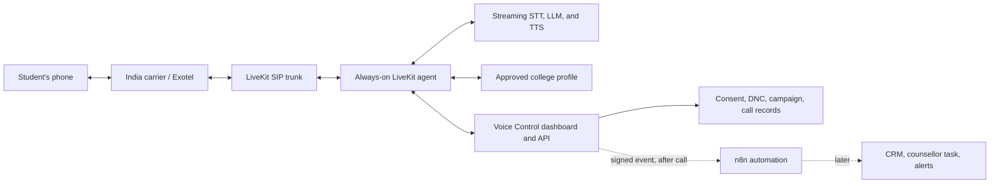

# Live Agent and Automation Boundary

## The Live Path

The student, carrier, SIP trunk, LiveKit agent, speech pipeline, and approved college profile form one continuous, real-time path. This path decides when to listen, when to stop speaking, what fact can be stated, and how to handle an interruption. The dashboard/API validates campaign and contact state, receives call records, and owns the consent and do-not-call ledger.

## The Deferred Automation Path

n8n receives a signed event only after a meaningful business outcome, such as a callback request, do-not-call request, completed call, or provider failure. It can create a counsellor task, write to a CRM, notify an operator, or synchronize downstream suppression. If n8n is offline, it must not interrupt or degrade the live conversation; the application stores the event for later delivery or retry.

## Why the Split Matters

Phone conversations require streaming media and near-immediate interruption cancellation. Workflow automation is designed for durable integrations and business actions. Keeping them separate prevents a slow CRM/API call or an unavailable n8n instance from causing the agent to continue an outdated answer or delay its response to a student.
